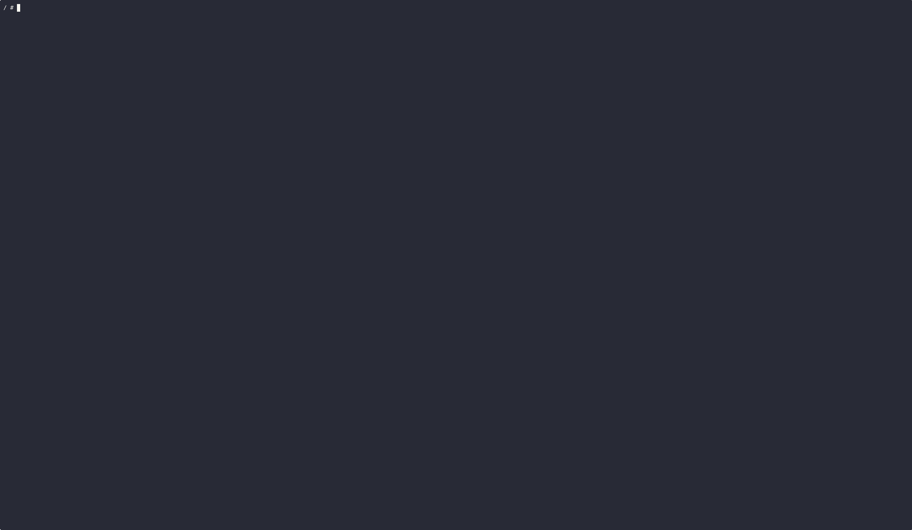

# play

[](https://goreportcard.com/report/github.com/paololazzari/play)


play is a TUI playground for your favorite programs, such as grep, sed and awk.

<p align="center">
    <picture>
      <source media="(prefers-color-scheme: dark)" srcset="docs/gopher.png">
      <source media="(prefers-color-scheme: light)" srcset="docs/gopher.png">
      
    </picture>
</p>

# Demo



It uses the excellent [tview](https://github.com/rivo/tview) library for the UI.

# Installation

```bash
$ git clone https://github.com/paololazzari/play
$ cd play
$ go build -o /usr/local/bin/
```

# Usage

```bash
./play <program>
```

N.B. The program must be installed on your machine.

The input is evaluated immediately as you type without any validation.
If you want to use `play` in read-only mode, thus avoding any file changes (such as those that would result if, for instance, `sed -i` was used), then you can use a docker container:

```bash
$ docker run -e "TERM=xterm-256color" --rm -it -v "$(pwd)":/play:ro plazzari/play:latest <program>
```

The `TERM` environment variable is needed to get color themes working properly.

To exit the application, use `Ctrl+C`.

To exit the application printing the input expression to stdout, use `Ctrl+S`.

## Key bindings

| Component       | Key           | Description |
|-----------------|---------------|-------------|
| Any                  | `Ctrl+C`      | Exit application |
| Any                  | `Ctrl+S`      | Exit application and print input expression to stdout |
| Command Options      | `Tab`         | Move focus to positional arguments  |
| Command Options      | `Shift+Tab`   | Move focus to file picker |
| Command Options      | `Enter`       | Move focus to output |
| Positional Arguments | `Tab`         | Move focus to file picker |
| Positional Arguments | `Shift+Tab`   | Move focus to command options |
| Positional Arguments | `Enter`       | Move focus to output |
| Positional Arguments | `Ctrl+O`      | Open wide editor |
| Wide Editor          | `Esc`         | Close wide editor |
| Wide Editor          | `Ctrl+O`      | Close wide editor |
| Wide Editor          | `Ctrl+Enter`  | Enter newline |
| Wide Editor          | `Enter`       | Move focus to output |
| File picker          | `Tab`         | Move focus to command options |
| File picker          | `Shift+Tab`   | Move focus to positional arguments options |
| File picker          | `Ctrl+O`      | Open selected file/Close selected file | 
| Output               | `Esc`         | Move focus to previous component |

# Credits

The lovely gopher was created with [gopherkon](https://github.com/quasilyte/gopherkon).